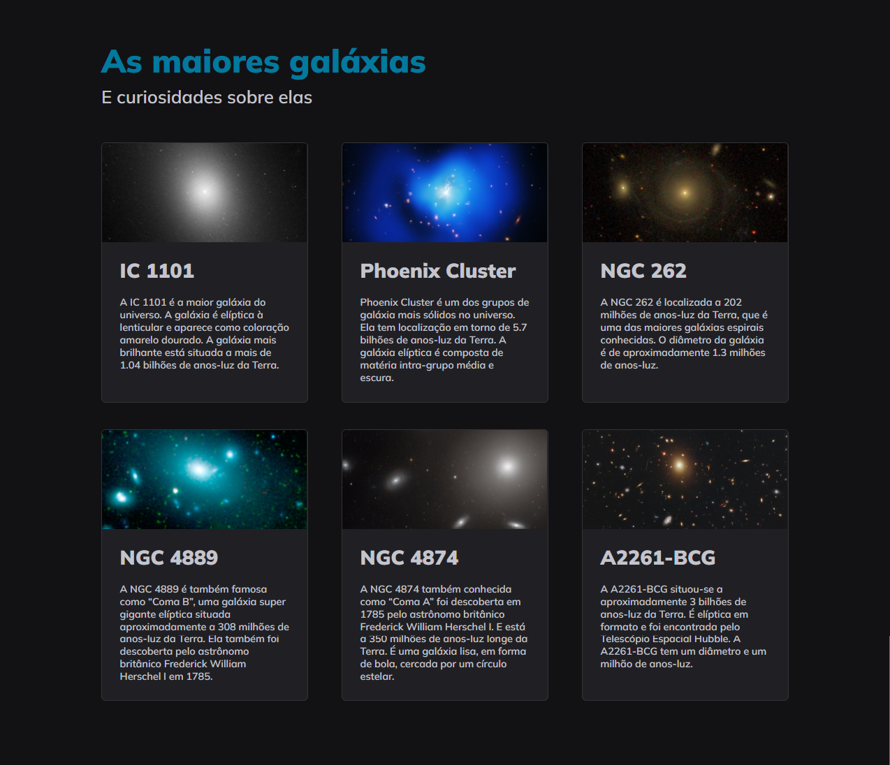

# GALAXIES 
### Projeto04-Stage03

 

> Trilha Explorer

### Projeto desenvolvido durante as aulas do Módulo 04, referente ao Stage 03, do curso da Rocketseat.

Novo projeto desenvolvido aplicando os conceitos sobre CSS Grid:
- Grid Templates Columns e Grid Templates Rows 
- Grid Column e Grid Row
- Gap
- Shorthand Grid Template
- Alinhamento Content, Items e Self
- Propriedades Grid Auto

 

  

## 🚀 Tecnologias

Esse projeto foi desenvolvido com as seguintes tecnologias:

- HTML
- CSS
- Git e Github

 

## Contato: gisellemacedo.dev@gmail.com

 
 

<h3 align="center">Feito com 💜 by Giselle</h3>
